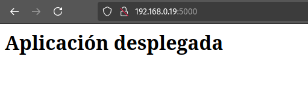
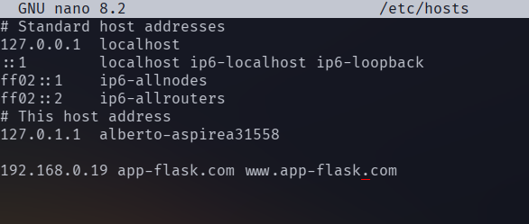
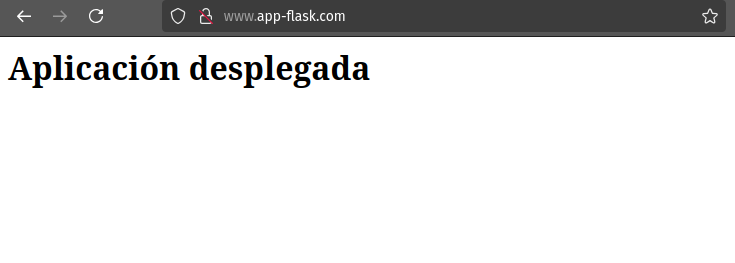

# Práctica 3-5. Despliegue de una aplicación Flask

## Instalación de prerrequisitos

Para instalar los paquetes necesarios para esta práctica hay que ejecutar: 

```console
sudo apt install nginx
sudo apt install python3-pip pipenv
```

De esta manera, tendremos instalados:

- Servidor Nginx.
- El gestor para paquetes de Python, pip.
- El gestor de entornos virtuales de Python, pipenv.

Podemos comprobar la correcta instalación de estas herramientas ejecutando:

```console
sudo nginx -v
pip -V
pipenv --version
pip list	# Mostrará todos los paquetes de Python instalados.
```

## Despliegue de una aplicación de prueba

Creamos un directorio para almacenar el contenido de nuestro proyecto en 
/var/www, hacemos dueño a nuestro usuario y le damos los permisos necesarios 
para que pueda ser leído por cualquier usuario: 

```console
sudo mkdir /var/www/app
sudo chown -R alberto:www-data /var/www/app
sudo chmod -R 775 /var/www/app
```

Creamos un archivo '.env' en el directorio del proyecto con el siguiente 
contenido:

```console
FLASK_APP=wsgi.py
FLASK_ENV=production
```

Iniciamos el entorno virtual e instalamos en él las dependencias de Flask y 
Gunicorn: 

```console
pipenv shell
pipenv install flask gunicorn
```

Creamos ahora una aplicación de prueba 'app.py':

```py
from flask import Flask

app = Flask(__name__)

@app.route('/')
def index():
	return '<h1>Aplicación desplegada</h1>
```

Y también un archivo 'wsgi.py', que será el encargado de ejecutar la aplicación 
principal:

```py
from app import app

if __name__ == '__main__':
	app.run(debug=False)
```

Tenemos que habilitar el puerto 5000:

```console
sudo ufw allow 5000
```

Desplegamos la aplicación ejecutando: 

```console
flask run --host '0.0.0.0'
```

Y comprobamos que está en funcionamiento:



Para comprobar que Gunicorn funciona correctamente ejecutamos el comando:

```console
gunicorn --workers 4 --bind 0.0.0.0:5000 wsgi:app
```

Y en el navegador veremos que también se ha desplegado la aplicación:


Aún dentro del enterno debemos comprobar la ruta desde la que se 
ejecuta gunicorn: 

```console
which gunicorn
	# /home/alberto/.local/share/virtualenvs/app-1lvW3LzD/bin/gunicorn
```

Ahora podemos salir del entorno virtual:

```console
deactivate
```

Creamos un archivo 'flask_app.service' en el directorio /etc/systemd/system/ 
para que se ejecute Gunicorn como si fuera un servicio del sistema. En mi caso, 
el contenido del archivo es: 


E iniciamos el servicio y comprobamos que funciona correctamente como si fuera 
cualquier otro servicio del sistema:

```console
sudo systemctl enable flask_app
sudo systemctl start flask_app
sudo systemctl status flask_app
```
Ahora sólo queda configurar Nginx y añadir el nombre de la página al archivo 
'hosts'. En primer lugar, creamos un archivo de configuración en 
/etc/nginx/sites-available y creamos un enlace simbólico a este archivo en 
/etc/nginx/sites-enabled. El archivo tendrá este contenido:

```console
server {
	listen 80;
	server_name app www.app;

	access_log /var/log/nginx/app.access.log;
	error_log /var/log/nginx/app.error.log;

	location / {
		include proxy_params;
		proxy_pass http://unix:/var/www/app/flask_app.sock;
	}
}
```

Creamos el enlace simbólico:

```console
sudo ln -s /etc/nginx/sites-available/app ../sites-enabled
```

Reiniciamos Nginx y comprobamos que no hay errores:

```console
sudo systemctl restart nginx
sudo nginx -t
sudo nginx status nginx
```

Ahora modificaremos en nuestra máquina anfitriona el archivo /etc/hosts para 
incluir el nombre de nuestra página y poder acceder con este nombre a través 
del navegador:



Y desde el navegador comprobamos que la aplicación funciona correctamente:



# Cuestiones finales

- ¿Qué es un servidor WSGI?

Un servidor WSGI es un intermediario entre un servidor web (como Nginx) y una 
aplicación web escrita en Python (como una aplicación de Flask). Su función es 
dirigir las peticiones del navegador hechas por un cliente a la aplicación Python 
y devolver la respuesta generada por dicha aplicación. 
